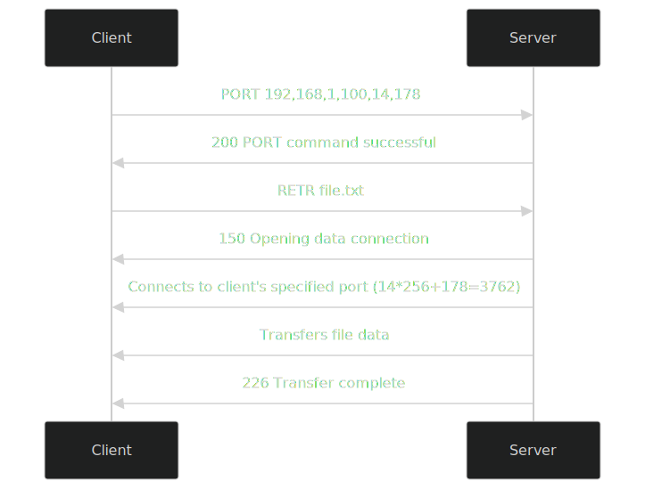
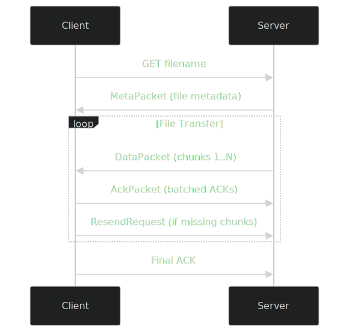

# 📦 AFTP - Advanced File Transfer Protocol (UDP-based)

---

## 🔍 What is AFTP?

**AFTP (Advanced File Transfer Protocol)** is a custom file transfer system built over **UDP**, focusing on **reliability, speed, and simplicity**. Unlike traditional FTP or TCP-based transfers, AFTP is fully built using **UDP sockets**, and handles reliability at the application level through custom logic.

It transfers files in chunks, automatically handles lost packets, and acknowledges successful delivery — all without stopping or waiting, preserving UDP's low-latency behavior.

---

## ❓Why AFTP?

### Problems with plain FTP:
FTP normally uses TCP, which is reliable but slower because of extra steps like connection setup and acknowledgments. To make transfers faster, we plan to create our own file transfer protocol using UDP and handle reliability ourselves.

lets see that in wire shark

Here in the FTP protocol we could see for that each window slide(here it is 2 packets) there is a ACK send back and only after the server receives it the next packet or a slide of packet is send 

### AFTP solves this by:

 In our AFTP approach instead of the waiting for the ACK the server keeps sending data and if a ACK is recived for a batch a window slide it will remove the batch from buffer if a packet is not recived it will send REQ to the server and makeing the batch bigger like 10 packets.

---

## 🧠 What I Know 
At the start i only know a basic level of C and the basics of networking
As the whole point of this project is to learn let's see what i learn at the end from this project

---
# The plan 
The plan is to learn everything as the project goes 
For the base have decided the rules for the protocol but during developing something might change 
##### ->Initial protocol rule
- **Start**
    - Client → `HELLO <filename>`
    - Server → `FILE_INFO <size, total_chunks, chunk_size>`        
- **Transfer**
    - Server sends chunks continuously (`chunk_id + data`)
    - No waiting for ACKs
- **ACK**
    - Client → `ACK <last_chunk_id>` (after receiving a group)
    - Server deletes buffered chunks up to that ID
- **Resend**
    - Client → `RESEND <missing_chunk_id>`
    - Server resends, then refreshes timestamp
    - Timeout → auto resend or drop old chunks
- **Recovery**
    - Only latest ACK is tracked
    - Resume transfer from last ACKed chunk if disconnected
---
# Getting started
#### Step 1
For the starting lets create a directory called AFTP
and create 2 files inside called server.c ,client.c
File structure
AFTP
├── client.c
└── server.c
Now testing out with basic hello socket program since we are on same network use 2 terminals tabs to run the program
client

server

Also captured the request in wireshark

#### Step 2
Now that the packet is being send lets try to send a file and save it 
client

server

wireshark

here as you can see the file is send and received successfully 
#### Step 3
Since the file is being transferred lets now define the chunks size and stuffs
We need define what will be send on a packet except the actual data(payload)
other than that we need to chunk size ,chunk id,time-out for removing from buffer in server,time-out for re sending the REQ for lost  packets,window slide or batch size the number of packets going to be considered a batch
And now to define this lets create a new file called protocol.h this structures will be used by both server and client

#define CHUNK_SIZE 1024
#define SERVER_PORT 8888
#define MAX_FILENAME 256
#define BUFFER_SIZE 100
#define ACK_BATCH 10
#define TIMEOUT_MS 1000

After defining the size etc lets check if the code works 
server

client

wireshark

here we can see for each 10 packets received there is one ACK sent back we can see it by seeing the ports 8888 is the server the sender and 45312 is the client the receiver 
also checked if there is any difference between send and received file 

here you can see there is no output for the command that means there is no difference between them 
but it took like 1 minutes to complete the transfer which is quiet a lot for a 9.6mb text file also since this done on a single device there is no packet loss thus you can see no REQ for the unrecived chunks.
#### Step 4
The next step now is to check if it works on 2 different devices on same network.Also including dynamic feature like working on custom IP and port since now everything is hard coded.also increase the speed and make the packet send doesn't wait for ACK also expirement with different chunk_size to find a optimal one.

---

## 🚀 Performance Goals

| Aspect               | FTP                  | AFTP                            |
|----------------------|----------------------|----------------------------------|
| Speed                | Slower (handshakes)  | Faster (continuous sending)     |
| Packet Loss Handling | TCP automatic retry  | Client sends `RESEND` requests  |
| Flow Control         | TCP buffers/window   | Manual chunk buffering          |
| ACK Behavior         | Silent (in TCP)      | Batched `ACK` after chunks      |
| Chunk Deletion       | N/A                  | After ACK or timeout            |

---

---

